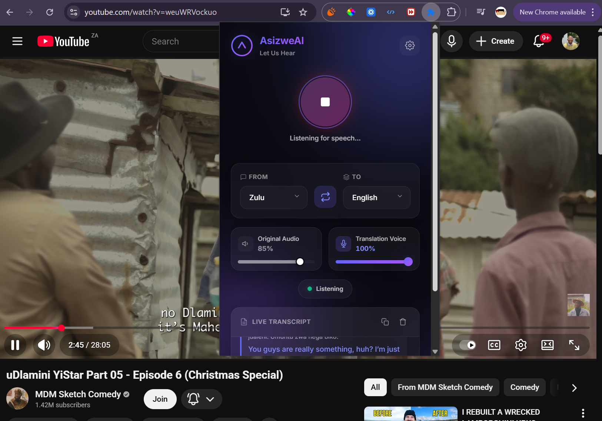

# AsizweAI

### **Real-time vernacular translation for the modern web.**
**Break language barriers instantly with AI-powered speech recognition and translation.**

[**Install**](#installation) · [**Features**](#features) · [**Tech Stack**](#tech-stack) · [**Roadmap**](#roadmap) · [**Contributing**](#contributing)

---



---

## About The Project

**AsizweAI** (meaning "Let Us Hear" in Zulu) is a Chrome extension that provides real-time translation of spoken vernacular, slang, and regional dialects into your preferred language. Whether you're watching a video, attending a virtual meeting, or consuming content in an unfamiliar dialect, AsizweAI captures the audio and delivers instant, context-aware translations.

Built with a focus on **African languages** (Zulu, Xhosa, Afrikaans) while supporting 15+ global languages, AsizweAI bridges communication gaps that traditional translators miss—preserving cultural nuance, tone, and idiomatic expressions.

### Why AsizweAI?

- **Vernacular First**: Unlike generic translators, we're optimized for colloquial speech, slang, and regional expressions
- **Real-Time Processing**: Hear translations as conversations happen, not after
- **Privacy Focused**: Audio is processed through secure APIs—nothing is stored on our servers
- **Cultural Preservation**: Translations maintain the emotional intent and cultural context of the original speech

<br />

## Features

### Core Capabilities

| Feature | Description |
|---------|-------------|
| **Real-Time Translation** | Instant speech-to-text-to-translation pipeline with sub-second latency |
| **Multi-Provider Support** | Choose between OpenAI Whisper, Deepgram Nova-2, or ElevenLabs for STT |
| **Voice Synthesis** | Hear translations spoken aloud with natural TTS voices |
| **Tab Audio Capture** | Translate any audio playing in your browser tab |

### User Experience

- **Glassmorphism UI** — Premium, modern interface inspired by Notion and Linear
- **One-Click Activation** — Start translating with a single button press
- **Live Transcript** — See original and translated text in real-time
- **Copy to Clipboard** — Export your transcript with one click
- **Swap Languages** — Quickly reverse translation direction
- **Volume Controls** — Independent control for original audio and translation voice

### Accessibility

- **WCAG 2.1 Compliant** — Full keyboard navigation and screen reader support
- **Reduced Motion Support** — Respects user preferences for animations
- **High Contrast Mode** — Enhanced visibility for users who need it

<br />

## Tech Stack

<table>
  <tr>
    <td align="center" width="96">
      <strong>Platform</strong>
    </td>
    <td>Chrome Extension (Manifest V3)</td>
  </tr>
  <tr>
    <td align="center" width="96">
      <strong>Frontend</strong>
    </td>
    <td>Vanilla JavaScript (ES Modules), CSS Custom Properties, HTML5</td>
  </tr>
  <tr>
    <td align="center" width="96">
      <strong>STT</strong>
    </td>
    <td>OpenAI Whisper · Deepgram Nova-2 · ElevenLabs Scribe · Web Speech API</td>
  </tr>
  <tr>
    <td align="center" width="96">
      <strong>Translation</strong>
    </td>
    <td>OpenAI GPT-4o-mini · LibreTranslate (fallback)</td>
  </tr>
  <tr>
    <td align="center" width="96">
      <strong>TTS</strong>
    </td>
    <td>ElevenLabs Turbo v2.5 · Native Web Speech Synthesis</td>
  </tr>
  <tr>
    <td align="center" width="96">
      <strong>Audio</strong>
    </td>
    <td>Web Audio API · Tab Capture API · Offscreen Documents</td>
  </tr>
</table>

### Architecture

```
┌─────────────────────────────────────────────────────────────────┐
│                        Chrome Extension                          │
├─────────────────────────────────────────────────────────────────┤
│  Popup UI          │  Service Worker      │  Offscreen Document │
│  ───────────       │  ───────────────     │  ─────────────────  │
│  • Controls        │  • Message Router    │  • Audio Capture    │
│  • Transcript      │  • Tab Capture       │  • STT Processing   │
│  • Settings        │  • State Management  │  • Translation      │
│                    │                      │  • TTS Playback     │
└─────────────────────────────────────────────────────────────────┘
                              │
                              ▼
              ┌───────────────────────────────┐
              │         External APIs          │
              ├───────────────────────────────┤
              │  OpenAI · Deepgram · ElevenLabs │
              └───────────────────────────────┘
```

<br />

## Installation

### Prerequisites

- Google Chrome (v88 or later)
- An API key from one of the following:
  - [OpenAI](https://platform.openai.com/api-keys) (recommended)
  - [Deepgram](https://console.deepgram.com/) (free $200 credits)
  - [ElevenLabs](https://elevenlabs.io/) (best for African languages)

### Developer Installation

1. **Clone the repository**

   ```bash
   git clone https://github.com/yourusername/asizwe-ai.git
   cd asizwe-ai
   ```

2. **Open Chrome Extensions**

   Navigate to `chrome://extensions` in your browser

3. **Enable Developer Mode**

   Toggle the "Developer mode" switch in the top-right corner

4. **Load the extension**

   Click "Load unpacked" and select the `asizwe-ai` folder

5. **Configure API Keys**

   - Click the AsizweAI icon in your toolbar
   - Click the settings (gear) icon
   - Enter your API key(s)
   - Select your preferred providers
   - Click "Save Settings"

6. **Start translating!**

   Navigate to any page with audio, click the AsizweAI icon, and press the microphone button

### Chrome Web Store

> Coming soon! The extension is currently in review.

<br />

## Usage

### Quick Start

1. **Navigate** to a page with audio content (YouTube, a meeting, etc.)
2. **Click** the AsizweAI extension icon
3. **Select** your source and target languages
4. **Press** the microphone button to start
5. **View** real-time transcripts and hear translations

### Language Support

<details>
<summary><strong>Supported Languages (16)</strong></summary>

| Language | Code | STT | Translation | TTS |
|----------|------|-----|-------------|-----|
| Auto-detect | `auto` | - | - | - |
| Zulu | `zu` | ElevenLabs | GPT-4o | Native |
| Xhosa | `xh` | ElevenLabs | GPT-4o | Native |
| Afrikaans | `af` | All | All | All |
| English | `en` | All | All | All |
| Spanish | `es` | All | All | All |
| French | `fr` | All | All | All |
| German | `de` | All | All | All |
| Portuguese | `pt` | All | All | All |
| Italian | `it` | All | All | All |
| Japanese | `ja` | All | All | All |
| Korean | `ko` | All | All | All |
| Chinese | `zh` | All | All | All |
| Hindi | `hi` | All | All | All |
| Arabic | `ar` | All | All | All |
| Russian | `ru` | All | All | All |

</details>

<br />

## Roadmap

### Current Release (v1.0)

- [x] Real-time tab audio capture
- [x] Multi-provider STT support
- [x] GPT-powered translation
- [x] Text-to-speech output
- [x] Glassmorphism UI redesign
- [x] Copy transcript to clipboard
- [x] Swap languages functionality
- [x] WCAG accessibility compliance

### Upcoming Features

- [ ] **Microphone Input** — Translate your own speech in conversations
- [ ] **Custom Vocabulary** — Add slang/jargon specific to your context
- [ ] **Conversation Mode** — Bi-directional translation for dialogue
- [ ] **Offline Mode** — Local models for privacy-sensitive use cases
- [ ] **Firefox Support** — Cross-browser extension
- [ ] **Mobile Companion** — React Native app for on-the-go translation
- [ ] **API Access** — Developer API for integration into other apps
- [ ] **Enterprise Features** — Team management, usage analytics

### Language Expansion

- [ ] Sotho (Northern & Southern)
- [ ] Tswana
- [ ] Swahili
- [ ] Yoruba
- [ ] Hausa
- [ ] Amharic

<br />

## Contributing

Contributions are what make the open source community such an amazing place to learn, inspire, and create. Any contributions you make are **greatly appreciated**.

1. Fork the Project
2. Create your Feature Branch (`git checkout -b feature/amazing-feature`)
3. Commit your Changes (`git commit -m 'Add some amazing feature'`)
4. Push to the Branch (`git push origin feature/amazing-feature`)
5. Open a Pull Request

### Development Guidelines

- Follow the existing code style (ES Modules, CSS Custom Properties)
- Ensure accessibility is maintained (test with screen readers)
- Add appropriate comments for complex logic
- Test with multiple STT/TTS providers

<br />

## License

Distributed under the MIT License. See `LICENSE` for more information.

<br />

## Acknowledgments

- [OpenAI](https://openai.com) for Whisper and GPT models
- [Deepgram](https://deepgram.com) for real-time speech recognition
- [ElevenLabs](https://elevenlabs.io) for natural voice synthesis
- [LibreTranslate](https://libretranslate.com) for open-source translation
- The Chrome Extensions team for Manifest V3 documentation

<br />

---

<p align="center">
  <strong>AsizweAI</strong> — Let Us Hear
  <br />
  <sub>Built with purpose. Designed for connection.</sub>
</p>

<p align="center">
  <a href="https://github.com/azandabot/asizwe-ai/issues">Report Bug</a>
  ·
  <a href="https://github.com/azandabot/asizwe-ai/issues">Request Feature</a>
</p>
